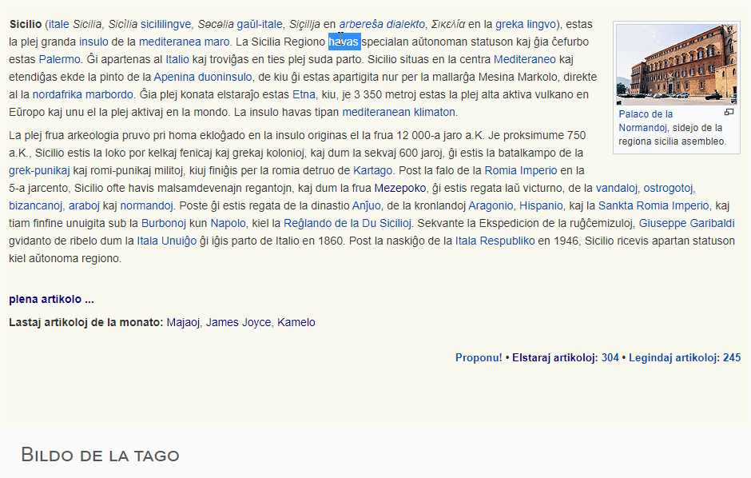

# Plena Vortaro

PIV kiel aldonaĵo por retumiloj.

## Funkciado

## Elŝutu la aldonaĵon

- [Chrome, Opera, Edge kaj aliaj chromium-bazitaj retumiloj](https://chrome.google.com/webstore/detail/plena-vortaro/kfnageeffnimnlohcgpnplfdgdnmolpo)
- [Firefox](https://addons.mozilla.org/en-US/firefox/addon/plena-vortaro/?utm_source=addons.mozilla.org&utm_medium=referral)

## Postuloj por kunmeti la fontkodon

Elŝutu jenajn programojn por kunmeti la fontkodon:

- [node](https://nodejs.org/en/)
- npm (ĝi aŭtomate instaliĝas kune kun node)

## Kiel kunmeti

[**Legu postulojn unue!**](#foo)

Navigu al dosierujo _chrome_ aŭ _firefox_ kaj plenumu komandon _npm i_ por instali necesajn pakaĵojn. Poste plenumu komandon _npm run build_ por kunmeti la dosierojn en dosierujon _public_.

## Licenco

Ĉi tiu programo estas sub licenco WTFPL, tio signifas ke oni povas fari kion je fek' oni volas kun la programo.
